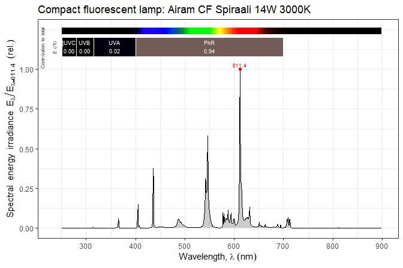

# photobiologyLamps 

<!-- badges: start -->

[](https://cran.r-project.org/package=photobiologyLamps)
[](https://cran.r-project.org/web/checks/check_results_photobiologyLamps.html)
[](https://github.com/aphalo/photobiologyLamps/actions)
<!-- badges: end -->

Package ‘**photobiologyLamps**’ complements other packages in the [*R
for photobiology* suite](https://www.r4photobiology.info/). It contains
spectral emission data for LED, fluorescent, incandescent and other
lamps (`lamps.mspct`). Spectra for light emitting diodes (LEDs) and LED
arrays (`leds.mspct`) available as electronic components are included in
package
[‘photobioloyLEDs’](https://docs.r4photobiology.info/photobiologyLEDs/).
Package ‘**photobiologyLamps**’ also includes spectra from UV-B
fluorescent tubes operating at different temperatures
(`qp_uvb313_temp.mspct` and `qp_uvb313_temp.spct`) and for a
four-channel LED buld supporting channel mixing (`ledsavers.mspct`).

This package contains only data. Data are stored as collections of
spectra of class `source_mspct` from package ‘photobiology’, which is
the core of the [*R for photobiology*
suite](https://www.r4photobiology.info/). Spectra can be easily plotted
with functions and methods from package
[‘ggspectra’](https://docs.r4photobiology.info/ggspectra/). The spectra
can be used seamlesly with functions from package
[‘photobioloy’](https://docs.r4photobiology.info/photobiology/).
However, class `source_mspct` is derived from `list` and class
`source_spct` is derived from `data.frame` making the data also usable
as is with base R functions.

## Examples

``` r
library(ggspectra)
library(photobiologyLamps)
```

The package includes spectral data for several lamps.

``` r
length(lamps.mspct)
#> [1] 50
```

``` r
length(qp_uvb313_temp.mspct)
#> [1] 7
```

``` r
length(ledsavers.mspct)
#> [1] 16
```

The first example shows you how to plot the emission spectrum of one of
the lamps.

``` r
autoplot(lamps.mspct$airam.spiraali,
         annotations = c("+", "title:what"))
```

<!-- -->

The second example shows how to access metadata.

``` r
what_measured(lamps.mspct$airam.spiraali)
#> [1] "Airam Spiraali 14W 220-240W 3000K E27 900 lm CRI>=80"
```

The members of the collection are named, and several vectors of names
are available, such as by manufacturer,

``` r
philips_lamps
#>  [1] "philips.BLB.tld108"     "philips.led.t8.10w.840" "philips.pls11w.827"    
#>  [4] "philips.tl01"           "philips.tl12"           "philips.tl12.mc"       
#>  [7] "philips.tl5.35w.830he"  "philips.tld.36w.18"     "philips.tld36w.15"     
#> [10] "philips.tld36w.18"      "philips.tld36w.83"      "philips.tld36w.865"    
#> [13] "philips.tld36w.89"      "philips.tld36w.92"      "philips.tll36w.950"
```

or type of lamp.

``` r
incandescent_lamps
#> [1] "incandescent.60w"    "osram.classic.20w"   "osram.conc.spot.60w"
#> [4] "pirkka.halogen.53w"
```

Temperature response data for emision from UV-B fluorescent tubes is
provided as a separate collection of spectra.

``` r
names(qp_uvb313_temp.mspct)
#> [1] "minus05C" "plus00C"  "plus05C"  "plus10C"  "plus20C"  "plus30C"  "plus35C"
```

## Installation

Installation of the most recent stable version from CRAN:

``` r
install.packages("photobiologyLamps")
```

Installation of the current unstable version from Bitbucket:

``` r
# install.packages("devtools")
devtools::install_bitbucket("aphalo/photobiologylamps")
```

## Documentation

HTML documentation is available at
(<https://docs.r4photobiology.info/photobiologyLamps/>), including a
*User Guide*.

News on updates to the different packages of the ‘r4photobiology’ suite
are regularly posted at (<https://www.r4photobiology.info/>).

Two articles introduce the basic ideas behind the design of the suite
and describe its use: Aphalo P. J. (2015)
(<https://doi.org/10.19232/uv4pb.2015.1.14>) and Aphalo P. J. (2016)
(<https://doi.org/10.19232/uv4pb.2016.1.15>).

A book is under preparation, and the draft is currently available at
(<https://leanpub.com/r4photobiology/>).

A handbook written before the suite was developed contains useful
information on the quantification and manipulation of ultraviolet and
visible radiation: Aphalo, P. J., Albert, A., Björn, L. O., McLeod, A.
R., Robson, T. M., & Rosenqvist, E. (Eds.) (2012) Beyond the Visible: A
handbook of best practice in plant UV photobiology (1st ed., p. xxx +
174). Helsinki: University of Helsinki, Department of Biosciences,
Division of Plant Biology. ISBN 978-952-10-8363-1 (PDF),
978-952-10-8362-4 (paperback). PDF file available from
(<https://hdl.handle.net/10138/37558>).

## Contributing

Pull requests, bug reports, and feature requests are welcome at
(<https://bitbucket.org/aphalo/photobiology>).

## Citation

If you use this package to produce scientific or commercial
publications, please cite according to:

``` r
citation("photobiologyLamps")
#> 
#> To cite package 'photobiologyLamps' in publications, please use:
#> 
#>   Aphalo, Pedro J. (2015) The r4photobiology suite. UV4Plants Bulletin,
#>   2015:1, 21-29. DOI:10.19232/uv4pb.2015.1.14
#> 
#> A BibTeX entry for LaTeX users is
#> 
#>   @Article{,
#>     author = {Pedro J. Aphalo},
#>     title = {The r4photobiology suite},
#>     journal = {UV4Plants Bulletin},
#>     volume = {2015},
#>     number = {1},
#>     pages = {21-29},
#>     year = {2015},
#>     doi = {10.19232/uv4pb.2015.1.14},
#>   }
```

## License

© 2013-2022 Pedro J. Aphalo (<pedro.aphalo@helsinki.fi>). Released under
the GPL, version 2 or greater. This software carries no warranty of any
kind.
